```mermaid
graph LR
    A[📝 Create Patient] --> B[🩺 Create Condition]
    B --> C[🔬 Validate Observation]
    C --> D[💊 Validate Medication]
    D --> E[📊 Generate Report]
    E --> F[✅ All Tests Passed]
```

# FHIR API Automation with Cypress 🚀

## 📖 Overview
This project demonstrates how to automate **FHIR (Fast Healthcare Interoperability Resources)** APIs using **Cypress**.  
The automation validates healthcare resources like **Patient, Condition, Observation, and Medication** with real-time reporting.  

---# 🏥 FHIR API Automation with Cypress 🚀

<div align="center">


**Automated Healthcare API Testing for FHIR Resources**

[Overview](#-overview) • [Features](#-project-highlights) • [Installation](#️-how-to-run-tests) • [Documentation](#-references)

</div>

---

## 📖 Overview

This project demonstrates how to automate **FHIR** (Fast Healthcare Interoperability Resources) APIs using **Cypress**. The automation validates healthcare resources like **Patient**, **Condition**, **Observation**, and **Medication** with real-time reporting.

---

## 🌍 What is FHIR?

**FHIR** (Fast Healthcare Interoperability Resources) is a global standard created by **HL7** (Health Level Seven International). It allows healthcare systems to communicate and exchange data seamlessly.

> 💡 **Think of it like a common language for healthcare applications** → so a hospital's EHR, a pharmacy system, and a lab system can all understand each other.

---

## 🏥 Why Interoperability Matters?

✨ **Better patient care** → doctors get accurate information faster  
🔒 **Secure data sharing** across hospitals, pharmacies, and labs  
📋 **Compliance standards** like HL7, USCDI, HTI-1  
⚡ **Reduces manual errors** and speeds up healthcare operations

---

## 🛠 Project Highlights

| Feature | Description |
|---------|-------------|
| ✅ **Automated FHIR Resources** | Patient, Condition, Observation, Medication |
| ✅ **HAPI FHIR Test Server** | Using [https://hapi.fhir.org/baseR4](https://hapi.fhir.org/baseR4) |
| ✅ **CRUD Operations** | Create, Read, Update, Delete |
| ✅ **Dynamic Test Data** | Read from fixtures (JSON files) → scalable & reusable |
| ✅ **Mochawesome Reports** | Beautiful HTML reports with detailed insights |
| ✅ **Real-time Validation** | Healthcare data consistency checks |

---

## 📂 Project Structure

```
cypress/
 ┣ 📂 e2e/                 # Test cases for FHIR APIs
 ┃ ┣ 📁 condition/         # Condition resource tests
 ┃ ┣ 📁 medication/        # Medication resource tests
 ┃ ┣ 📁 observation/       # Observation resource tests
 ┃ ┗ 📁 patient/           # Patient resource tests
 ┣ 📂 fixtures/            # Test data in JSON format
 ┣ 📂 reports/             # Test execution reports (HTML & JSON)
 ┣ 📂 support/             # Support commands & config
 📄 cypress.config.js      # Cypress configuration file
 📄 package.json           # Node.js dependencies
```

---

## ▶️ How to Run Tests

### 1️⃣ Clone this repository
```bash
git clone <repository-url>
cd <repository-folder>
```

### 2️⃣ Install dependencies
```bash
npm install
```

### 3️⃣ Run tests
```bash
npx cypress run
```

### 4️⃣ Generate merged Mochawesome report
```bash
npx mochawesome-merge cypress/reports/*.json > cypress/reports/merged.json
npx marge cypress/reports/merged.json --reportDir cypress/reports/final
```

### 5️⃣ Open the report
```bash
cypress/reports/final/merged.html
```

---

## 📊 Example Test Flow



1. **Create Patient** → POST request with mock data
2. **Create Condition** → linked to Patient resource
3. **Validate Observation/Medication** → GET requests to confirm data
4. **Check Reports** → Verify all tests passed with Mochawesome

---

## 🌟 Outcome

🎯 **Automated validation** of healthcare APIs  
🔗 **Demonstrates FHIR interoperability** in action  
📈 **Real-time Cypress reports** for better monitoring  
🏆 **Production-ready** test framework

---

## 🔮 Next Steps

- [ ] Add more FHIR resources for wider test coverage
- [ ] Integrate with CI/CD pipelines for continuous validation
- [ ] Extend to real EHR systems for production-grade interoperability
- [ ] Implement authentication & security testing
- [ ] Add performance & load testing scenarios

---

## 📌 References

🔗 [**HL7 Official Site**](https://www.hl7.org/)  
🔗 [**HAPI FHIR Test Server**](https://hapi.fhir.org/baseR4)  
🔗 [**Cypress Documentation**](https://docs.cypress.io/)  
🔗 [**FHIR Specification**](https://www.hl7.org/fhir/)

---

## 👨‍💻 Author

<div align="center">

**Saran Kumar**

[](https://github.com/sarankumar)
[](https://linkedin.com/in/sarankumar)

*Built with ❤️ for Healthcare Interoperability & Automation*

---

⭐ **If you find this project helpful, please give it a star!** ⭐

</div>

---

## 📄 License

This project is licensed under the MIT License - see the [LICENSE](LICENSE) file for details.

---

<div align="center">

**Made with ☕ & 💻**

</div>

## 🌍 What is FHIR?
FHIR (**Fast Healthcare Interoperability Resources**) is a global standard created by **HL7 (Health Level Seven International)**.  
It allows healthcare systems to **communicate and exchange data seamlessly**.  

Think of it like a **common language for healthcare applications** → so a hospital’s EHR, a pharmacy system, and a lab system can all understand each other.  

---

## 🏥 Why Interoperability Matters?
- Better **patient care** → doctors get accurate information faster.  
- **Secure data sharing** across hospitals, pharmacies, and labs.  
- Helps in meeting compliance standards like **HL7, USCDI, HTI-1**.  
- Reduces manual errors and speeds up healthcare operations.  

---

## 🛠 Project Highlights
- ✅ Automated **FHIR resources** → Patient, Condition, Observation, Medication  
- ✅ Used **HAPI FHIR Test Server** → [https://hapi.fhir.org/baseR4](https://hapi.fhir.org/baseR4)  
- ✅ Implemented **CRUD operations** (Create, Read, Update, Delete)  
- ✅ Dynamically read data from **fixtures (JSON files)** → scalable & reusable tests  
- ✅ Integrated **Mochawesome reporting** → generates beautiful HTML reports  
- ✅ Real-time validation of healthcare data consistency  

---

## 📂 Project Structure
```
cypress/
 ┣ e2e/                 # Test cases for FHIR APIs
 ┃ ┣ condition/         # Condition resource tests
 ┃ ┣ medication/        # Medication resource tests
 ┃ ┣ observation/       # Observation resource tests
 ┃ ┗ patient/           # Patient resource tests
 ┣ fixtures/            # Test data in JSON format
 ┣ reports/             # Test execution reports (HTML & JSON)
 ┣ support/             # Support commands & config
cypress.config.js       # Cypress configuration file
package.json            # Node.js dependencies
```

---

## ▶️ How to Run Tests
1. Clone this repo  
2. Install dependencies:  
   ```bash
   npm install
   ```  
3. Run tests:  
   ```bash
   npx cypress run
   ```  
4. Generate merged Mochawesome report:  
   ```bash
   npx mochawesome-merge cypress/reports/*.json > cypress/reports/merged.json
   npx marge cypress/reports/merged.json --reportDir cypress/reports/final
   ```  
5. Open the report:  
   ```
   cypress/reports/final/merged.html
   ```

---

## 📊 Example Test Flow
1. **Create Patient** → POST request with mock data  
2. **Create Condition** → linked to Patient resource  
3. **Validate Observation/Medication** → GET requests to confirm data  
4. **Check Reports** → Verify all tests passed with Mochawesome  

---

## 🌟 Outcome
- Automated validation of **healthcare APIs**  
- Demonstrates **FHIR interoperability** in action  
- Generates **real-time Cypress reports** for better monitoring  

---

## 🔮 Next Steps
- Add more FHIR resources for wider test coverage  
- Integrate with **CI/CD pipelines** for continuous validation  
- Extend to real **EHR systems** for production-grade interoperability  

---

## 📌 References
- [HL7 Official Site](https://www.hl7.org/fhir/)  
- [HAPI FHIR Test Server](https://hapi.fhir.org/baseR4)  
- [Cypress Documentation](https://docs.cypress.io)  

---

👨‍💻 Built with ❤️ for **Healthcare Interoperability & Automation**
